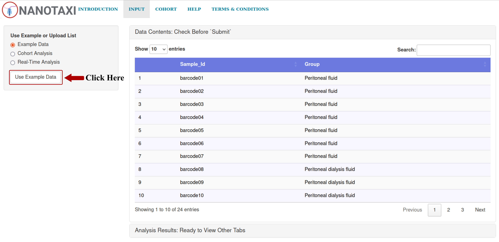

# NANOTAXI

Offering Real-time 16s DNA Classification of Long Read Sequencing.


## Features

- Faster Results from Real-time Workflow for Multiplexed Data
- Easy to use GUI for Researchers with minimal coding background
- Richer Insights from various Downstream analyses and publication-ready plots
- Offline Analysis using different pipelines available for Nanopore Sequencing

## Classification Tools and Database Compatibility in NANOTAXI

| Tool | Mode | GTDB | REFSEQ | GSR | MIMT | EMU DB |
|------|------|------|--------|-----|------|--------|
| Kraken2 | Both | ✓ | ✓ | ✓ | ✓ | ✓ |
| Minimap2 | Both | ✓ | ✓ | ✓ | ✓ | ✓ |
| EMU | Both | ✓ | ✓ | ✓ | ✓ | ✓ |
| BLAST | Both | ✓ | ✓ | ✓ | ✓ | ✓ |

#### Legend
- ✓: Tool supports this database
- **EMU DB**: Proprietary database format for EMU.
- **Both**: Supported in both real-time mode and offline mode (Post-run).


## Installation

To run the app locally, please install R version >= 4.4.2. Also, please ensure that the MinKNOW app version >= 24.06.10.

You can install R and all the required R packages using a single command. If not present, this command will install the conda and create a new environment named nanotaxi-env.

```bash
if which conda >/dev/null; then
        
        echo "Conda Exist"

else
        source ~/.bashrc
        
        wget https://repo.anaconda.com/miniconda/Miniconda3-latest-Linux-x86_64.sh -O miniconda.sh \
        && chmod +x miniconda.sh && bash miniconda.sh -b -p miniconda

        rm -r miniconda.sh
        
        base_dir=$(echo $PWD)
        
        export PATH=$base_dir/miniconda/bin:$PATH
        
        source ~/.bashrc
        
        echo -e "$base_dir/miniconda/etc/profile.d/conda.sh" >> ~/.profile
        
        conda init bash

fi

conda create -n nanotaxi-env --file Installation/nanotaxi-env.txt -y
```

If you have installed R from the above command, then to run the app, please activate the conda environment first using the following command:

```bash
conda activate nanotaxi-env
```

Launch the app using the following command:

```r
shiny::runApp("main_app.R")
```

You can also run the app directly from GitHub using the following command:

```r
shiny::runGitHub("NANOTAXI", "Nirmal2310")
```

The app will download and install the required Conda environments and databases necessary for real-time classification of long reads when it starts up for the first time. So, please ensure that enough free space is available on the system.

**Running in Remote Server**

If you are running the application on the remote server and want to open the interface in the local browser, please use the given step-by-step guide:

- Assign a port for running a local R Shiny server by using the following command:

```bash
echo "options(shiny.port=5316)" >> ~/.Rprofile
```
Here, I have assigned the port **5316** for running R Shiny Applications. Please ensure that the port is free before assigning it to run Shiny Applications.

- Connect to the Remote Server in a new window by using the following command:

```bash
ssh -L 8080:localhost:5316 hostname@ip_address
```
Change the local host port number, host name and the IP address accordingly.

- Now launch the Shiny App through the server's terminal:

```bash
shiny::runApp("main_app.R", launch.browser=FALSE)
```

- Finally, open NANOTAXI in your browser of choice by entering the following address:

```bash
http://127.0.0.1:8080
```
<br>

While setting up the MinKNOW app for sequencing, please make sure that under the **barcoding setting**, both **Trim barcodes** and **Barcode both ends** are disabled as shown below:


This is to minimise the rate of unclassified reads during a live run. NANOTAXI utilises Dorado to trim the barcodes during the analysis of demultiplexed barcoded reads, ensuring the removal of synthetic DNA sequence.

<br>

Additionally, in the **Output settings**, please select **Number of reads** under the **Based on** option and enter **500** under the **Reads threshold** option, as the app will process the barcoded data in batches of 500 reads per barcode. The reference screenshot is shown below:


<br>

Lastly, Minknow core 5.x requires a secure channel connection to be made by the Minknow API. In order to do this, please add the following line to the ~/.bashrc:

```bash
echo "export MINKNOW_TRUSTED_CA=\"/var/lib/minknow/data/rpc-certs/minknow/ca.crt\"" >> ~/.bashrc
source ~/.bashrc
```

To set up Offline Analysis, tick the checkbox adjacent to the setup option in **Offline Analysis** under the **INPUT** tab. It will first download and install all the required software and databases, and then analyse the data.<br> 
However, all pipelines are currently available in both real-time and offline settings. All required software and databases will be downloaded and installed during the initial launch of the application.


## Usage/Examples

The Test Dataset is taken from the Bioproject ID [PRJEB82315](https://www.ebi.ac.uk/ena/browser/view/PRJEB82315).

We have used [Emu](https://www.nature.com/articles/s41592-022-01520-4) with its custom database to analyse the test dataset comprising 20 samples representing 20 barcodes and classified into three groups based on body fluids.

<div  class="sample_info">

| Barcode   | Sample      | Group     |
| :--------:| :-------:   | ------- |
| barcode01 | ERR13935186 | Crop Digesta |
| barcode02 | ERR13935187 | Crop Digesta |
| barcode03 | ERR13935188 | Crop Digesta |
| barcode04 | ERR13935189 | Crop Digesta |
| barcode05 | ERR13935191 | Crop Digesta |
| barcode06 | ERR13935192 | Zymobiomics |
| barcode07 | ERR13935193 | Zymobiomics |
| barcode08 | ERR13935195 | Zymobiomics |
| barcode09 | ERR13935223 | Zymobiomics |
| barcode10 | ERR13935225 | Zymobiomics |
| barcode11 | ERR13935170 | Feces |
| barcode12 | ERR13935171 | Feces |
| barcode13 | ERR13935172 | Feces |
| barcode14 | ERR13935174 | Feces |
| barcode15 | ERR13935176 | Feces |
| barcode16 | ERR13935177 | Feces |
| barcode17 | ERR13935178 | Feces |
| barcode18 | ERR13935181 | Feces |
| barcode19 | ERR13935182 | Feces |
| barcode20 | ERR13935184 | Feces |

</div>

<br>

The user can run the example dataset by selecting **Example Data**, adding the control group name in **Select Control Group** and clicking **Use Example Data** under the **INPUT** tab.



## Demo

Please see the demo of Real-time classification by using the following [link](TODO)

## Documentation

For detailed information about NANOTAXI, please refer to the [Documentation](https://github.com/Nirmal2310/NANOTAXI/blob/main/Tabs/additional_information.md).

## Roadmap

- [x] Add Differential Abundance Analysis.
- [x] Add support for GSR DB, MIMt DB, REFSEQ, EMUDB and GTDB.
- [ ] Add support for SQK-MAB114.24 (16S + ITS).

## Authors

- [Nirmal Singh Mahar](https://scholar.google.com/citations?user=eOqR6ekAAAAJ&hl=en)
- [Ishaan Gupta](https://scholar.google.co.in/citations?user=H8yFVJYAAAAJ&hl=en)

## Feedback/Help

If you have any feedback/issues, please report the issue via [GitHub](https://github.com/Nirmal2310/NANOTAXI/issues).

## Acknowledgements

#### Pipelines/Software Used in the App:
- [Dorado](https://github.com/nanoporetech/dorado)
- [KRAKEN2](https://genomebiology.biomedcentral.com/articles/10.1186/s13059-019-1891-0)
- [EMU](https://www.nature.com/articles/s41592-022-01520-4)
- [BLASTn](https://blast.ncbi.nlm.nih.gov/Blast.cgi?PROGRAM=blastn&BLAST_SPEC=GeoBlast&PAGE_TYPE=BlastSearch)
- [TaxonKit](https://www.sciencedirect.com/science/article/pii/S1673852721000837)
- [BBTools](https://jgi.doe.gov/data-and-tools/software-tools/bbtools/)
- [Chopper](https://academic.oup.com/bioinformatics/article/39/5/btad311/7160911?login=true)
- [SeqKit](https://onlinelibrary.wiley.com/doi/10.1002/imt2.191)
- [Minimap2](https://academic.oup.com/bioinformatics/article/34/18/3094/4994778)
- [GNU Parallel](https://zenodo.org/records/14911163)

#### Databases Used in the App:
- [GTDB](https://academic.oup.com/nar/article/50/D1/D785/6370255)
- [NCBI 16s Database](https://ftp.ncbi.nlm.nih.gov/refseq/TargetedLoci/Bacteria/)
- [GSR DB](https://journals.asm.org/doi/10.1128/msystems.00950-23)
- [MIMt](https://link.springer.com/article/10.1186/s40793-024-00634-w)
- [EMUDB](https://osf.io/56uf7/files/qrbne)

#### Python Packages Used in the App:
- [minknow-api](https://github.com/nanoporetech/minknow_api) = 6.0.4
- [grpcio](https://pypi.org/project/grpcio/) = 1.60.1
- [pandas](https://pypi.org/project/pandas/)
- [pysam](https://pysam.readthedocs.io/en/latest/index.html#danecek-2021)

#### R Packages Used in the App:
- [shiny](https://cran.r-project.org/web/packages/shiny/index.html)
- [shinyBS](https://cran.r-project.org/web/packages/shinyBS/index.html)
- [reticulate](https://rstudio.github.io/reticulate/)
- [tidyverse](https://www.tidyverse.org/packages/)
- [shinyjs](https://github.com/daattali/shinyjs)
- [DT](https://github.com/rstudio/DT)
- [plotly](https://github.com/plotly/plotly.R)
- [shinyFiles](https://github.com/thomasp85/shinyFiles)
- [markdown](https://cran.r-project.org/web/packages/markdown/index.html/)
- [validate](https://github.com/data-cleaning/validate)
- [ggpubr](https://github.com/kassambara/ggpubr)
- [cowplot](https://wilkelab.org/cowplot/)
- [dendextend](https://github.com/talgalili/dendextend)
- [BiocManager](https://github.com/Bioconductor/BiocManager)
- [vegan](https://github.com/vegandevs/vegan)
- [gridExtra](https://cran.r-project.org/web/packages/gridExtra/index.html)
- [ggsci](https://github.com/nanxstats/ggsci)
- [scales](https://github.com/r-lib/scales)
- [viridis](https://github.com/sjmgarnier/viridis)
- [circlize](https://github.com/jokergoo/circlize)
- [ggrepel](https://cran.r-project.org/web/packages/ggrepel/vignettes/ggrepel.html)
- [devtools](https://github.com/r-lib/devtools)
- [compositions](https://cran.r-project.org/web/packages/compositions/index.html)
- [forcats](https://github.com/tidyverse/forcats?tab=readme-ov-file)
- [formattable](https://renkun-ken.github.io/formattable/)
- [future](https://future.futureverse.org/)
- [promises](https://rstudio.github.io/promises/)
- [ggtext](https://wilkelab.org/ggtext/)
- [FactoMineR](https://cran.r-project.org/web/packages/FactoMineR/index.html)
- [ggforce](https://ggforce.data-imaginist.com/)
- [ComplexHeatmap](https://github.com/jokergoo/ComplexHeatmap)
- [pairwiseAdonis](https://github.com/pmartinezarbizu/pairwiseAdonis)
- [ANCOM-BC2](https://github.com/FrederickHuangLin/ANCOMBC)
