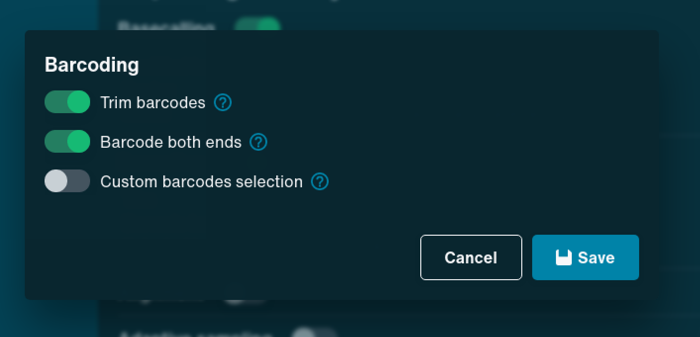
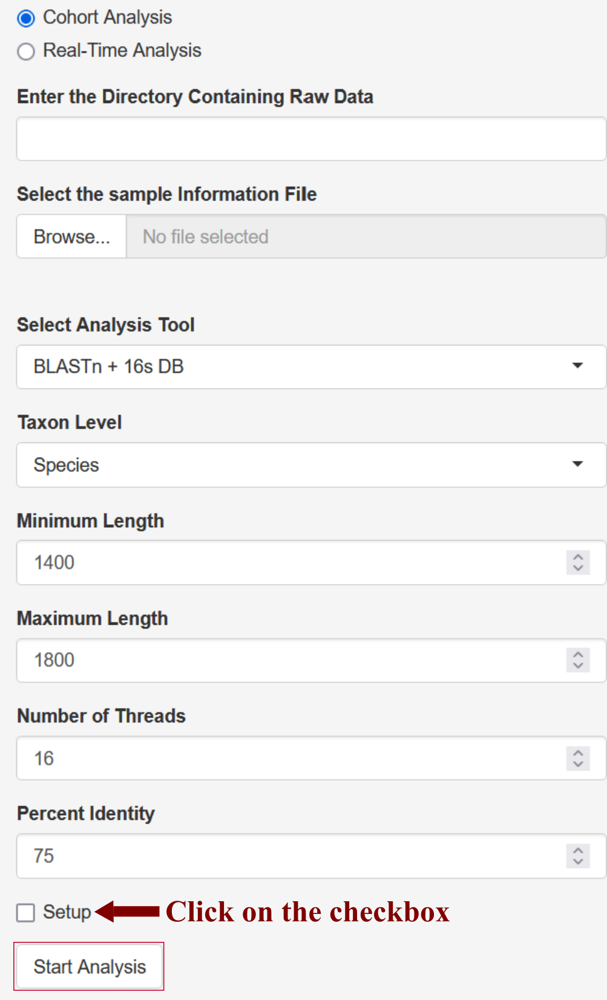

# NANOTAXI

Offering Real-time 16s DNA Classification of Long Read Sequencing.


## Features

- Faster Results from Real-time Workflow for Multiplexed Data
- Easy to use GUI for Researchers with minimal coding background
- Richer Insights from various Downstream analyses and publication-ready plots
- Offline Analysis using different pipelines available for Nanopore Sequencing


## Installation

To run the app locally, please install R version >= 4.3.3 and RStudio. Also, please ensure that the MinKNOW app version >= 24.06.10.

You can install R and all the required packages using a single command. If not present, this command will install the conda and create a new environment named nanotaxi-env.

```bash
if which conda >/dev/null; then
        
        echo "Conda Exist"

else
        source ~/.bashrc
        
        wget https://repo.anaconda.com/miniconda/Miniconda3-latest-Linux-x86_64.sh -O miniconda.sh \
        && chmod +x miniconda.sh && bash miniconda.sh -b -p miniconda

        rm -r miniconda.sh
        
        base_dir=$(echo $PWD)
        
        export PATH=$base_dir/miniconda/bin:$PATH
        
        source ~/.bashrc
        
        echo -e "$base_dir/miniconda/etc/profile.d/conda.sh" >> ~/.profile
        
        conda init bash

fi

conda create -n nanotaxi-env --file Installation/nanotaxi-env.txt -y
```

If you have installed R from the above command, then to run the app, please activate the conda environment first using the following command:

```bash
conda activate nanotaxi-env
```

Launch the app using the following command:

```r
shiny::runApp("main_app.R")
```

You can also run the app directly from GitHub using the following command:

```r
# Make Sure that the shiny package is installed in the R.
shiny::runGitHub("NANOTAXI", "Nirmal2310")
```

This app will download the conda environments and databases required to classify long reads in real-time while starting up for the first time. So, please ensure that enough free space is available on the system. 

While setting up the MinKNOW app for sequencing, please make sure that under the **barcoding setting**, both **Trim barcodes** and **Barcode both ends** are enabled as shown below:



Also, in the **Output settings**, please select **Time elapsed** under **Based on** option and **Every 1 minute** under **Frequency** option as the app will read the output data every 2 minutes. The reference screenshot is shown below:


To set up Offline Analysis, tick the checkbox adjacent to the setup option in **Offline Analysis** under the **INPUT** tab. It will first download and install all the required software and databases and then analyse the data.



## Usage/Examples

The Test Dataset is from a [study](https://www.frontiersin.org/journals/microbiology/articles/10.3389/fmicb.2023.1324494/full) published in Frontiers in Microbiology. In this study, the authors tested the utility of Nanopore 16s sequencing as a rapid diagnostic approach for identifying bacteria in infected body fluids instead of traditional culture methods. They compared three pipelines: [Epi2me](https://nanoporetech.com/resource-centre/epi2me-wimp-workflow-quantitative-real-time-species-identification-metagenomic), [Emu](https://www.nature.com/articles/s41592-022-01520-4) and [NanoCLUST](https://academic.oup.com/bioinformatics/article/37/11/1600/5929694) and concluded that Emu demonstrated the highest concordance with the culture results.

We have used [Emu](https://www.nature.com/articles/s41592-022-01520-4) to analyze the test dataset comprising 24 samples representing 24 barcodes and classified into four groups based on body fluids.

<div  class="sample_info">

| Barcode   | Sample      | Group     |
| :--------:| :-------:   | ------- |
| barcode01 | ERR13935186 | Crop Digesta |
| barcode02 | ERR13935187 | Crop Digesta |
| barcode03 | ERR13935188 | Crop Digesta |
| barcode04 | ERR13935189 | Crop Digesta |
| barcode05 | ERR13935191 | Crop Digesta |
| barcode06 | ERR13935192 | Zymobiomics |
| barcode07 | ERR13935193 | Zymobiomics |
| barcode08 | ERR13935195 | Zymobiomics |
| barcode09 | ERR13935223 | Zymobiomics |
| barcode10 | ERR13935225 | Zymobiomics |
| barcode11 | ERR13935170 | Feces |
| barcode12 | ERR13935171 | Feces |
| barcode13 | ERR13935172 | Feces |
| barcode14 | ERR13935174 | Feces |
| barcode15 | ERR13935176 | Feces |
| barcode16 | ERR13935177 | Feces |
| barcode17 | ERR13935178 | Feces |
| barcode18 | ERR13935181 | Feces |
| barcode19 | ERR13935182 | Feces |
| barcode20 | ERR13935184 | Feces |

</div>

<br>

The user can run the example dataset by selecting **Example Data** and clicking **Use Example Data** under **INPUT** tab.


## Demo

Please see the demo of Real-time classification by using the following [link](https://youtu.be/LOkDb61RztI?si=2ywIz-i96st7GZby)

## Documentation

For detailed information about NANOTAXI, please refer to the [Documentation](https://github.com/Nirmal2310/NANOTAXI/blob/main/Tabs/additional_information.md).

## Roadmap

- [x] Add Differential Bacterial Abundance Analysis
- [ ] Add support for Minimap2 + GSR DB (Real-time), Kraken2 + GTDB (Real-time) and Kraken2 + SILVA (Offline)

## Authors

- [Nirmal Singh Mahar](https://scholar.google.com/citations?user=eOqR6ekAAAAJ&hl=en)
- [Ishaan Gupta](https://scholar.google.co.in/citations?user=H8yFVJYAAAAJ&hl=en)

## Feedback/Help

If you have any feedback/issues, please contact us at nanotaxi.help@gmail.com or report the issue via [GitHub](https://github.com/Nirmal2310/NANOTAXI/issues).

## Acknowledgements

#### Pipelines/Software Used in the App:
- [KRAKEN2](https://genomebiology.biomedcentral.com/articles/10.1186/s13059-019-1891-0)
- [EMU](https://www.nature.com/articles/s41592-022-01520-4)
- [BLASTn](https://blast.ncbi.nlm.nih.gov/Blast.cgi?PROGRAM=blastn&BLAST_SPEC=GeoBlast&PAGE_TYPE=BlastSearch)
- [TaxonKit](https://www.sciencedirect.com/science/article/pii/S1673852721000837)
- [BBTools](https://jgi.doe.gov/data-and-tools/software-tools/bbtools/)
- [NanoFilt](https://academic.oup.com/bioinformatics/article/34/15/2666/4934939?login=true)

#### Databases Used in the App:
- [Greengenes](https://www.ncbi.nlm.nih.gov/pmc/articles/PMC1489311/)
- [NCBI 16s Database](https://ftp.ncbi.nlm.nih.gov/refseq/TargetedLoci/Bacteria/)

#### Python Packages Used in the App:
- [minknow-api](https://github.com/nanoporetech/minknow_api) = 6.0.4
- [grpcio](https://pypi.org/project/grpcio/) = 1.60.1
- [pandas](https://pypi.org/project/pandas/)

#### R Packages Used in the App:
- [shiny](https://cran.r-project.org/web/packages/shiny/index.html)
- [shinyBS](https://cran.r-project.org/web/packages/shinyBS/index.html)
- [reticulate](https://rstudio.github.io/reticulate/)
- [tidyverse](https://www.tidyverse.org/packages/)
- [shinyjs](https://github.com/daattali/shinyjs)
- [DT](https://github.com/rstudio/DT)
- [plotly](https://github.com/plotly/plotly.R)
- [shinyFiles](https://github.com/thomasp85/shinyFiles)
- [markdown](https://cran.r-project.org/web/packages/markdown/index.html/)
- [validate](https://github.com/data-cleaning/validate)
- [ggpubr](https://github.com/kassambara/ggpubr)
- [dendextend](https://github.com/talgalili/dendextend)
- [BiocManager](https://github.com/Bioconductor/BiocManager)
- [vegan](https://github.com/vegandevs/vegan)
- [gridExtra](https://cran.r-project.org/web/packages/gridExtra/index.html)
- [ggsci](https://github.com/nanxstats/ggsci)
- [scales](https://github.com/r-lib/scales)
- [viridis](https://github.com/sjmgarnier/viridis)
- [circlize](https://github.com/jokergoo/circlize)
- [ggrepel](https://cran.r-project.org/web/packages/ggrepel/vignettes/ggrepel.html)
- [devtools](https://github.com/r-lib/devtools)
- [compositions](https://cran.r-project.org/web/packages/compositions/index.html)
- [forcats](https://github.com/tidyverse/forcats?tab=readme-ov-file)
- [formattable](https://renkun-ken.github.io/formattable/)
- [future](https://future.futureverse.org/)
- [promises](https://rstudio.github.io/promises/)
- [ggtext](https://wilkelab.org/ggtext/)
- [FactoMineR](https://cran.r-project.org/web/packages/FactoMineR/index.html)
- [ggforce](https://ggforce.data-imaginist.com/)
- [ComplexHeatmap](https://github.com/jokergoo/ComplexHeatmap)
- [pairwiseAdonis](https://github.com/pmartinezarbizu/pairwiseAdonis)
- [ANCOM-BC2](https://github.com/FrederickHuangLin/ANCOMBC)
