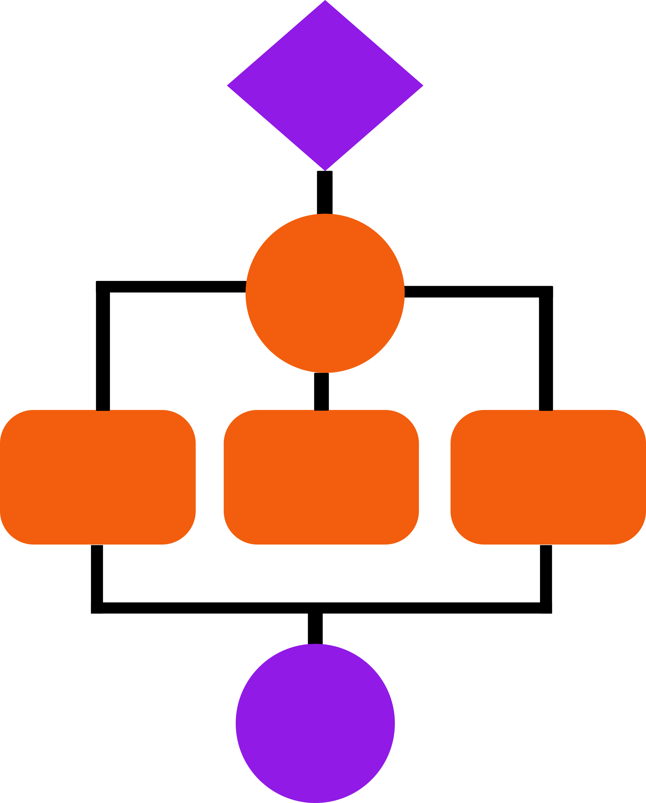

---
output:
  html_document:
    theme: united
---

<h1 style="text-align:left; font-weight:bold; font-size:30px">Offering Real-Time 16S Reads Classification of Long-Read Sequencing.</h1>

##  <b>FEATURES</b>

  <figure>
    
    <figcaption>
      <b>Faster Results</b> from Real-time
      Workflow for  
      Multiplexed Data.
    </figcaption>
  </figure>

  <figure>
    
    <figcaption>
      <b>Intuitive Interface</b> for Easy Navigation 
      of Complex Data.
    </figcaption>
  </figure>
  <figure>
    
    <figcaption>
      <b>Richer Insights</b> from different post analysis  
      and visualization.
    </figcaption>
  </figure>
  <figure>
    
    <figcaption>
      <b>Offline Analysis</b> using different 
      pipelines available 
      for Nanopore Sequencing.
    </figcaption>
  </figure>

 
<b>EXPLORE</b> the app's features with the example dataset by selecting <b>Example Data</b> in <b>INPUT</b> tab.

<b>UPLOAD</b> your own samples list and process the data through either through <b>Offline</b> mode or <b>Real-time</b> mode.

##  <b>DATA VISUALIZATION</b>

- Top N Taxons Per Sample (Stacked Barplot)
- Alpha Diversity and Abundance Comparison (Box-plots)
- Clustering (HeatMap, PCoA Plot, PCA BiPlot, NMDS Plot)
- Taxon Differential Abundance Analysis (Volcano Plot)
- Functional Differential Abundance Analysis (Dot Plot, Bi-directional Bar Plot)

##  <b>DATA FORMAT</b>
- Must be a .csv **comma-separated-value** file.
- File must have two columns with the headers 1: Sample_Id, 2: Group.
  - <b>Sample_Id</b>: Barcode ID.
  - <b>Group</b>: The group that the Barcode belongs to.
- The first row of the file is the header.

##  <b>INPUT DATA</b>
- Each row from the first column representes the barcode ID.
- Each row from the second column representes the group (multiple groups can be present).

| Sample_Id            | Group    
|-----------------|--------
| barcode01        |   Crop Digesta   
| barcode02        |   Crop Digesta
| barcode03        |   Crop Digesta
| barcode04        |   Crop Digesta
| barcode05        |   Crop Digesta
| barcode06        |   Zymobiomics
| barcode07        |   Zymobiomics
| barcode08        |   Zymobiomics
| barcode09        |   Zymobiomics
| barcode10        |   Zymobiomics
| barcode11        |   Feces
| barcode12        |   Feces
| barcode13        |   Feces
| barcode14        |   Feces
| barcode15        |   Feces
| barcode16        |   Feces
| barcode17        |   Feces
| barcode18        |   Feces
| barcode19        |   Feces
| barcode20        |   Feces

##  <b>OUTPUT DATA</b>
- Each row of the First column represents the Taxon (For this case, its **Species**)
- Rest of the columns represent the 24 barcodes. The numeric values represent the read counts corresponding to each Species across all barcodes.

| Species                                          | barcode01        | barcode02        | barcode03        | barcode04        | barcode05        | barcode06        | barcode07        | barcode08        | barcode09        | barcode10        | barcode11        | barcode12        | barcode13        | barcode14        | barcode15        | barcode16        | barcode17        | barcode18        | barcode19        | barcode20        |
|:--------------------------------------------------|:------------------|:------------------|:------------------|:------------------|:------------------|:------------------|:------------------|:------------------|:------------------|:------------------|:------------------|:------------------|:------------------|:------------------|:------------------|:------------------|:------------------|:------------------|:------------------|:------------------|
| Campylobacter jejuni                             | 180.991028442058 | 269.598197801976 | 0                | 260.811642543672 | 168.881555384445 | 0                | 0                | 0                | 0                | 0                | 0                | 0                | 0                | 0                | 0                | 0                | 0                | 0                | 0                | 0                |
| Enterococcus cecorum                             | 12784.7903910196 | 21883.9480805205 | 1327.29172478979 | 2820.34940684495 | 29.002544204639  | 0                | 0                | 0                | 0                | 0                | 0                | 0                | 0                | 0                | 0                | 0                | 0                | 0                | 0                | 0                |
| Escherichia coli                                 | 3756.22607013967 | 126.047630530988 | 376.725885524447 | 27.0215297269712 | 0                | 27841.1161926918 | 18410.4472555767 | 21272.4542239098 | 17552.6721562524 | 11630.3039001375 | 139.33624957098  | 0                | 337.051265656356 | 0                | 21.039407864616  | 0                | 0                | 0                | 329.537726416183 | 716.564750150068 |
| Lactobacillus crispatus                          | 72277.616179126  | 41156.4490436336 | 337.287294527492 | 31770.1332767136 | 18239.9336640415 | 0                | 0                | 0                | 0                | 0                | 0                | 0                | 0                | 0                | 18.8105858090054 | 0                | 0                | 0                | 0                | 0                |
| Laceyella sacchari                               | 197.959536039938 | 85.7585820540571 | 66.7329855774953 | 83.869698209294  | 65.7473599527248 | 65.9142148211675 | 65.8520791906249 | 61.8151607154187 | 149.105397778527 | 22.8893044377443 | 152.536999353841 | 99.2333472262032 | 107.33774402952  | 115.024690725041 | 130.196340240569 | 104.822709773328 | 48.0791466738958 | 82.9791534542392 | 69.9374502273034 | 192.84110279029  |

##  <b>MORE INFORMATION</b>

Detailed Information about the installation, entire pipeline and all the visualization plots are provided under the **HELP** tab.

##  <b>DEVELOPED BY</b>

The R Shiny Application has been developed by Nirmal Singh Mahar<b>1</b> and Ishaan Gupta<b>1\*</b>.

<b>1</b><b>Department of Biochemical Engineering and Biotechnology, IIT Delhi</b>

<b>\*</b><b>Corresponding Author</b>
 

##  <b>CITATION</b>

[NANOTAXI: R Shiny GUI For Classifying 16S Nanopore Seqequencing Reads in Real-time]()

  <b>The source code of NANOTAXI is available on</b> 

  <b>We would appreciate reports of any issues with the app through GitHub Issues</b>

