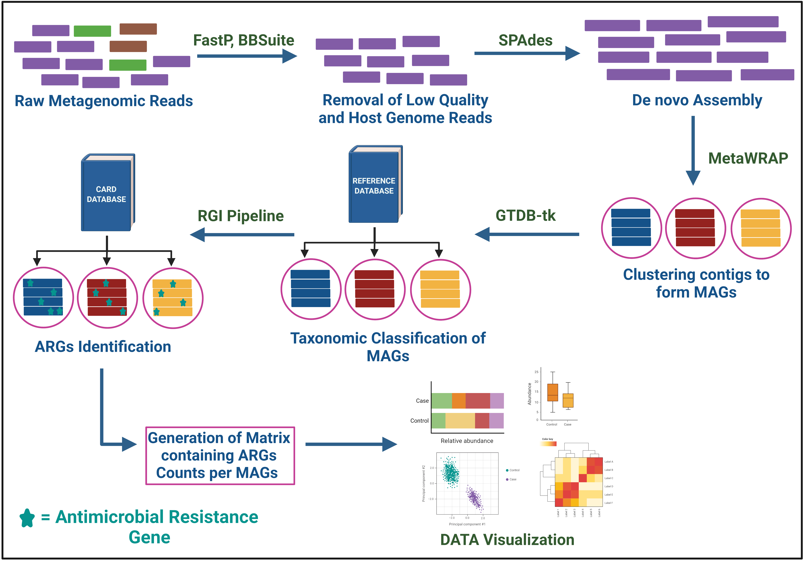
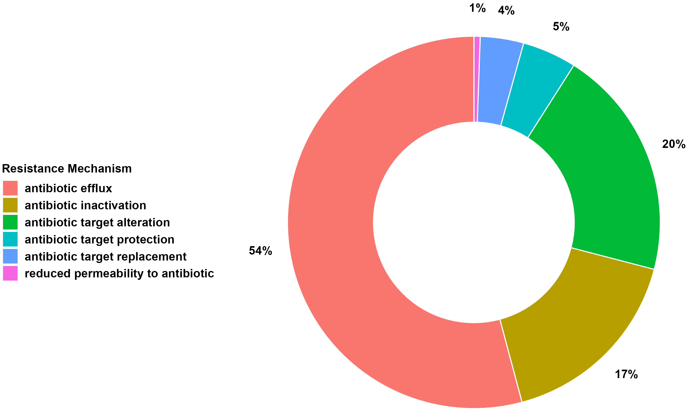
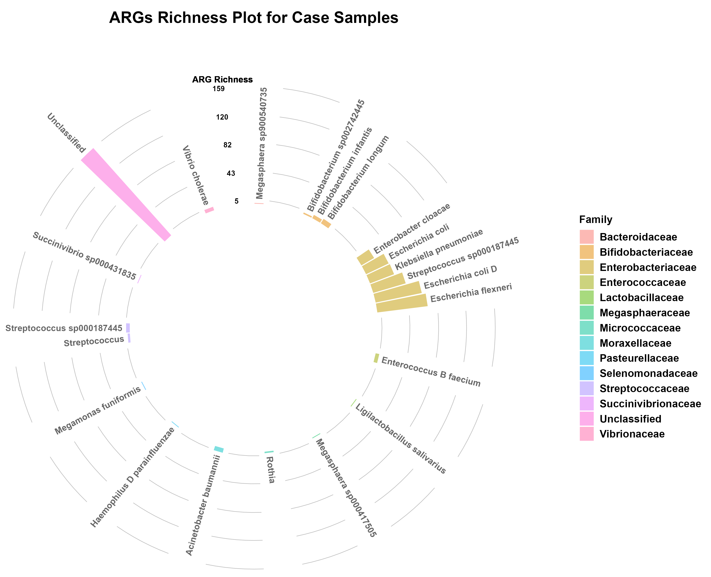
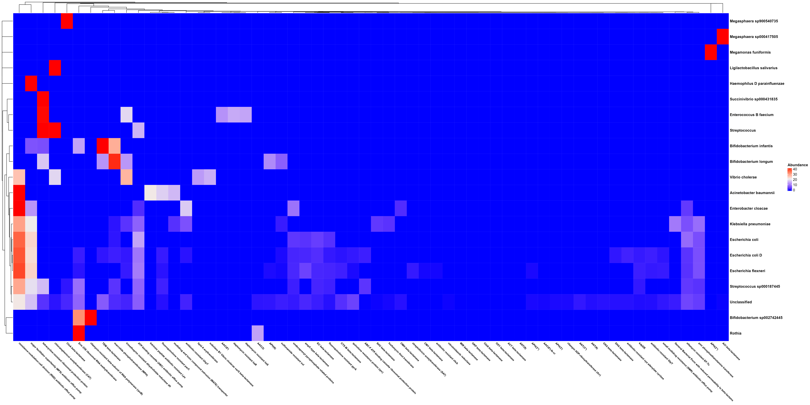
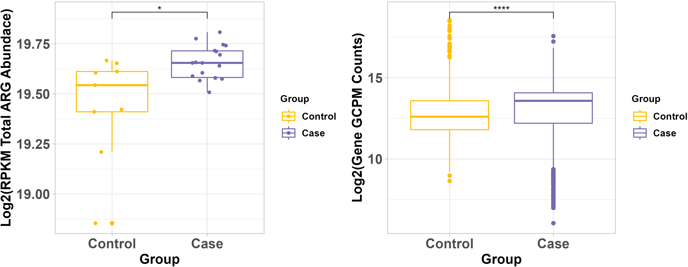
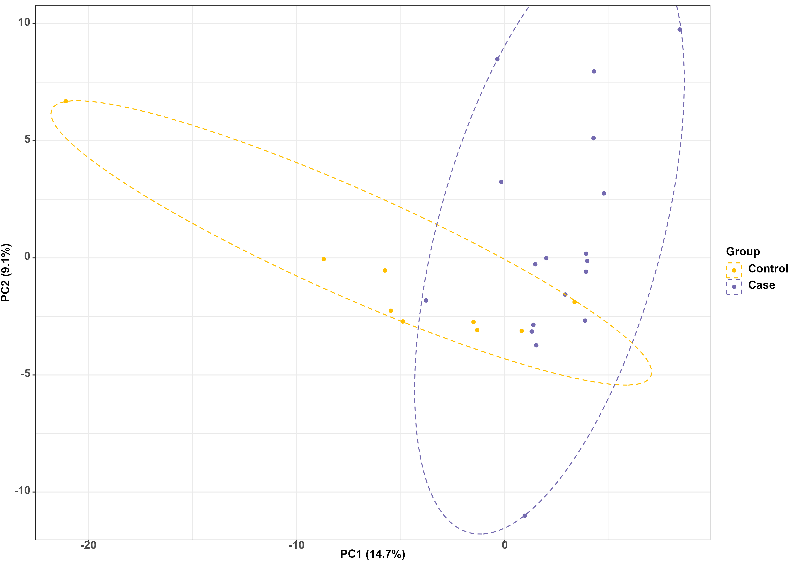
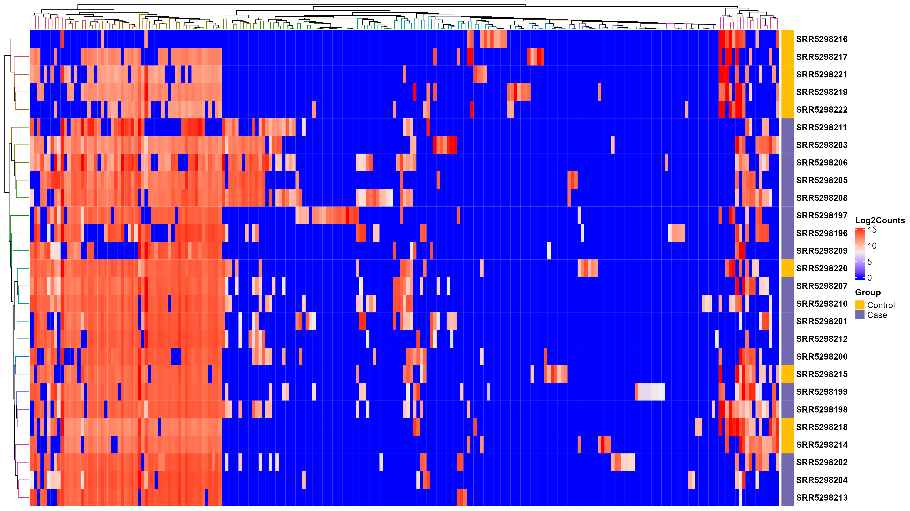

<script type="text/javascript"
  src="https://cdnjs.cloudflare.com/ajax/libs/mathjax/2.7.1/MathJax.js?config=TeX-AMS-MML_HTMLorMML">
</script>

### **NanoTAXI app allows users to analyze and visualize metagenomic short-read sequencing data.**

- It takes a list containing the sample names and their respective groups (Control or Case). 

- The Fastq file must have a the same name as the sample name in the list.

- The app will perform end to end analysis using the sequencing data with appropriate tools.

# **Instructions**

Code can be found on [github](https://github.com/Nirmal2310/NanoTAXI)

Please post [issues](https://github.com/Nirmal2310/NanoTAXI) on github, and feel free to contribute by forking and submitting development branches.

To run this app locally on your machine, download R or RStudio in the local system.

You may now run the shiny app with just one command in R:

```
shiny::runGitHub("NanoTAXI", "Nirmal2310")
```

If you are running the App for the first time please tick the checkbox "setup" in the Input Data tab to install the required tools, R packages and databases.

# **Input Data**

You can use this app by

1. Exploring the pre-loaded example data set. This is a pre-loaded metagenome DNA sequencing of ten samples example for exploring the app's features.
2. Upload your own data

<a name="dataformat"></a> 

## **Data Format** 

- Must be a .CSV *comma-separated-value* file.
- File must have a header row.
- First column must be named as `Sample_Id`.
- Second column must be named as `Group`.

<style>
  .sample_info {
    height: 200px;
    overflow-y: scroll;
    border: 1px solid #000000; 
    width: 53%;
    margin-left:5%;
    margin-right:5%
  }

  .sample_info th, .sample_info td {
      border: 1px solid #000000;
      border-spacing: 0;
      text-align: center;
      padding-top: 10px; padding-left:70px; padding-right: 70px; padding-bottom: 10px
    }
</style>

<div class="sample_info">

| Sample_Id         | Group    
|-------------------|--------
| SRR5298196        |   Case   
| SRR5298197        |   Case   
| SRR5298198        |   Case   
| SRR5298199        |   Case   
| SRR5298200        |   Case   
| SRR5298201        |   Case   
| SRR5298202        |   Case   
| SRR5298203        |   Case   
| SRR5298204        |   Case   
| SRR5298205        |   Case   
| SRR5298206        |   Case   
| SRR5298207        |   Case   
| SRR5298208        |   Case   
| SRR5298209        |   Case   
| SRR5298210        |   Case   
| SRR5298211        |   Case   
| SRR5298212        |   Case   
| SRR5298213        |   Case   
| SRR5298214        |   Control
| SRR5298215        |   Control
| SRR5298216        |   Control
| SRR5298217        |   Control
| SRR5298218        |   Control
| SRR5298219        |   Control
| SRR5298220        |   Control
| SRR5298221        |   Control
| SRR5298222        |   Control
</div>

<br>

Example Sample Information file: [Sample Information](Sample_information.csv)

# **Analysis** 

When the list is uploaded, the data is then analyzed by the app. The app first utilizes fastp and bbtools for data pre-processing (removing adapter sequences, low quality reads and host contamination). The preprocessed FASTQ reads are then assembled using SPADES in De Novo fashion. The assembled metagenome is then binned in MAGs (Metagenome Assembled Genomes) using metaWRAP. All the MAGs with % Completeness >= 55 and % Contamination <= 10 are retained for further analysis. Users can change the cutoff while starting the analysis in the Input Data tab. The binned MAGs are annotated using GTDBtk. Antimicrobial Resistance Genes (ARGs) from the binned MAGs are then identified using RGI with CARD database. The uniquely mapped read counts for each ARG are calculated using SAMtools. The final table from the unix pipeline contains the ARO term, Counts, Bacterial Classification and other information. The counts for each ARG terms are then normalized using GPCM method in R and then utilized for further analysis and visualization in R. To determine resistome Case-Control association, we calculated RPKM value (equation 2) of each ARG gene per sample. We then summed up the ARG RPKM abundance per sample and compared the abundance between the Case and Control Groups. To assess the statistical significance of this assosiation, we have used Wilcox rank-sum test. Graphical abstract of Metashiny is shown below:
<br>
$$GCPM(i) = \frac{\{Counts(i)/Gene\,Length(i)\}*10^6}{\sum (Counts/Gene Length)};\;GCPM(i) = GCPM\;Value\;of\;Gene\;i \quad(1)$$

$$RPKM(i) = \frac{Counts(i)*10^6}{(\sum Counts) * Gene\;Length\;(Kb)};\;
RPKM(i) = RPKM\;Value\;of\;Gene\;i \quad(2)$$

<br>



<br>

#### **Figure 1: Overview of MetaShiny Pipeline**

<a name="outputdata"></a> 

## **Analyzed Data Output**
<br>
<style>
  .output_data {
    height: 400px;
    overflow-y: scroll;
    border: 1px solid #cccccc;
  }
  .output_data th, .output_data td {
      border: 1px solid #000000;
      border-spacing: 0;
      text-align: center;
      padding: 8px;
      }
</style>
<div class="output_data">

|**ARO_term**|**ARG_length**|**Counts**|**Percentage_Identity**|**Drug_Class**|**Resistance_Mechanism**| **AMR_Gene_Family**|**Percentage_Coverage**|**Classification**|**Sample_Id**|**Normalized_counts**|**Family**|**Group**|
|:--------------------------------------------------------------------------------:|:----------------:|:------------:|:-------------------------:|:--------------------------------------------:|:------------------------------------:|:---------------------------------------------------------------------------------------:|:-------------------------:|:----------------------------------:|:---------------:|:-----------------------:|:---------------------------:|:-----------:|
| "ErmX"                                                                           | 855              | 160          | 90.14                     | "macrolide antibiotic"                       | "antibiotic target alteration"       | "Erm 23S ribosomal RNA methyltransferase"                                               | 100                       | "Rothia"                           | "SRR5298196"    | 1333.29                 | "Micrococcaceae"            | "Case"      |
| "AAC(3)-IIc"                                                                     | 801              | 23           | 96.24                     | "aminoglycoside antibiotic"                  | "antibiotic inactivation"            | "AAC(3)"                                                                                | 93.01                     | "Rothia"                           | "SRR5298196"    | 204.58                  | "Micrococcaceae"            | "Case"      |
| "tetM"                                                                           | 1920             | 8268         | 98.9                      | "tetracycline antibiotic"                    | "antibiotic target protection"       | "tetracycline-resistant ribosomal protection protein"                                   | 100                       | "Streptococcus sp000187445"        | "SRR5298196"    | 30680.97                | "Streptococcaceae"          | "Case"      |
| "msrE"                                                                           | 1476             | 5539         | 100                       | "macrolide antibiotic"                       | "antibiotic target protection"       | "ABC-F ATP-binding cassette ribosomal protection protein"                               | 100                       | "Streptococcus sp000187445"        | "SRR5298196"    | 26737.13                | "Streptococcaceae"          | "Case"      |
| "mphE"                                                                           | 885              | 3190         | 100                       | "macrolide antibiotic"                       | "antibiotic inactivation"            | "macrolide phosphotransferase (MPH)"                                                    | 100                       | "Streptococcus sp000187445"        | "SRR5298196"    | 25681.31                | "Streptococcaceae"          | "Case"      |
| "ugd"                                                                            | 1167             | 3127         | 99.23                     | "peptide antibiotic"                         | "antibiotic target alteration"       | "pmr phosphoethanolamine transferase"                                                   | 100                       | "unclassified"                     | "SRR5298196"    | 19090.92                | "unclassified"              | "Case"      |
| "gadW"                                                                           | 729              | 3585         | 99.59                     | "macrolide antibiotic"                       | "antibiotic efflux"                  | "resistance-nodulation-cell division (RND) antibiotic efflux pump"                      | 100                       | "unclassified"                     | "SRR5298196"    | 35037.36                | "unclassified"              | "Case"      |
| "mdtA"                                                                           | 1248             | 2529         | 99.04                     | "aminocoumarin antibiotic"                   | "antibiotic efflux"                  | "resistance-nodulation-cell division (RND) antibiotic efflux pump"                      | 100                       | "unclassified"                     | "SRR5298196"    | 14437.9                 | "unclassified"              | "Case"      |
| "mdtB"                                                                           | 3123             | 5630         | 99.81                     | "aminocoumarin antibiotic"                   | "antibiotic efflux"                  | "resistance-nodulation-cell division (RND) antibiotic efflux pump"                      | 100                       | "unclassified"                     | "SRR5298196"    | 12844.17                | "unclassified"              | "Case"      |
| "mdtC"                                                                           | 3060             | 5628         | 99.61                     | "aminocoumarin antibiotic"                   | "antibiotic efflux"                  | "resistance-nodulation-cell division (RND) antibiotic efflux pump"                      | 99.41                     | "unclassified"                     | "SRR5298196"    | 13103.96                | "unclassified"              | "Case"      |
| "baeS"                                                                           | 1404             | 2396         | 99.36                     | "aminoglycoside antibiotic"                  | "antibiotic efflux"                  | "resistance-nodulation-cell division (RND) antibiotic efflux pump"                      | 100                       | "unclassified"                     | "SRR5298196"    | 12158.77                | "unclassified"              | "Case"      |
| "baeR"                                                                           | 723              | 1523         | 98.75                     | "aminoglycoside antibiotic"                  | "antibiotic efflux"                  | "resistance-nodulation-cell division (RND) antibiotic efflux pump"                      | 100                       | "unclassified"                     | "SRR5298196"    | 15008.3                 | "unclassified"              | "Case"      |
| "acrB"                                                                           | 3150             | 8986         | 100                       | "fluoroquinolone antibiotic"                 | "antibiotic efflux"                  | "resistance-nodulation-cell division (RND) antibiotic efflux pump"                      | 100                       | "unclassified"                     | "SRR5298196"    | 20324.77                | "unclassified"              | "Case"      |
| "Escherichia coli acrA"                                                          | 1194             | 4109         | 99.75                     | "fluoroquinolone antibiotic"                 | "antibiotic efflux"                  | "resistance-nodulation-cell division (RND) antibiotic efflux pump"                      | 100                       | "unclassified"                     | "SRR5298196"    | 24518.93                | "unclassified"              | "Case"      |
| "evgS"                                                                           | 3594             | 2097         | 97.41                     | "macrolide antibiotic"                       | "antibiotic efflux"                  | "major facilitator superfamily (MFS) antibiotic efflux pump"                            | 100                       | "unclassified"                     | "SRR5298196"    | 4157.1                  | "unclassified"              | "Case"      |
| "mdtG"                                                                           | 1227             | 3028         | 99.75                     | "fosfomycin"                                 | "antibiotic efflux"                  | "major facilitator superfamily (MFS) antibiotic efflux pump"                            | 100                       | "unclassified"                     | "SRR5298196"    | 17582.52                | "unclassified"              | "Case"      |
| "mdtH"                                                                           | 1209             | 2645         | 99.75                     | "fluoroquinolone antibiotic"                 | "antibiotic efflux"                  | "major facilitator superfamily (MFS) antibiotic efflux pump"                            | 100                       | "unclassified"                     | "SRR5298196"    | 15587.24                | "unclassified"              | "Case"      |
| "PmrF"                                                                           | 969              | 1127         | 99.69                     | "peptide antibiotic"                         | "antibiotic target alteration"       | "pmr phosphoethanolamine transferase"                                                   | 100                       | "unclassified"                     | "SRR5298196"    | 8286.48                 | "unclassified"              | "Case"      |
| "Escherichia coli ampH beta-lactamase"                                           | 1158             | 3572         | 99.74                     | "cephalosporin"                              | "antibiotic inactivation"            | "ampC-type beta-lactamase"                                                              | 100                       | "unclassified"                     | "SRR5298196"    | 21977.22                | "unclassified"              | "Case"      |
| "emrB"                                                                           | 1539             | 522          | 99.8                      | "fluoroquinolone antibiotic"                 | "antibiotic efflux"                  | "major facilitator superfamily (MFS) antibiotic efflux pump"                            | 100                       | "unclassified"                     | "SRR5298196"    | 2416.58                 | "unclassified"              | "Case"      |
| "Escherichia coli ampC1 beta-lactamase"                                          | 1305             | 1870         | 100                       | "cephalosporin"                              | "antibiotic inactivation"            | "ampC-type beta-lactamase"                                                              | 100                       | "unclassified"                     | "SRR5298196"    | 10209.42                | "unclassified"              | "Case"      |
| "kdpE"                                                                           | 678              | 892          | 100                       | "aminoglycoside antibiotic"                  | "antibiotic efflux"                  | "kdpDE"                                                                                 | 100                       | "unclassified"                     | "SRR5298196"    | 9373.57                 | "unclassified"              | "Case"      |
| "mdtN"                                                                           | 1032             | 3330         | 98.83                     | "nucleoside antibiotic"                      | "antibiotic efflux"                  | "major facilitator superfamily (MFS) antibiotic efflux pump"                            | 100                       | "unclassified"                     | "SRR5298196"    | 22989.75                | "unclassified"              | "Case"      |
| "CRP"                                                                            | 633              | 2845         | 99.52                     | "macrolide antibiotic"                       | "antibiotic efflux"                  | "resistance-nodulation-cell division (RND) antibiotic efflux pump"                      | 100                       | "unclassified"                     | "SRR5298196"    | 32021.99                | "unclassified"              | "Case"      |
| "YojI"                                                                           | 1644             | 3309         | 99.63                     | "peptide antibiotic"                         | "antibiotic efflux"                  | "ATP-binding cassette (ABC) antibiotic efflux pump"                                     | 100                       | "unclassified"                     | "SRR5298196"    | 14340.51                | "unclassified"              | "Case"      |
| "eptA"                                                                           | 1644             | 4729         | 100                       | "peptide antibiotic"                         | "antibiotic target alteration"       | "pmr phosphoethanolamine transferase"                                                   | 100                       | "unclassified"                     | "SRR5298196"    | 20494.5                 | "unclassified"              | "Case"      |
| "marA"                                                                           | 384              | 907          | 99.21                     | "fluoroquinolone antibiotic"                 | "antibiotic efflux"                  | "resistance-nodulation-cell division (RND) antibiotic efflux pump"                      | 100                       | "unclassified"                     | "SRR5298196"    | 16828.52                | "unclassified"              | "Case"      |
| "bacA"                                                                           | 822              | 2541         | 99.63                     | "peptide antibiotic"                         | "antibiotic target alteration"       | "undecaprenyl pyrophosphate related proteins"                                           | 100                       | "unclassified"                     | "SRR5298196"    | 22024.33                | "unclassified"              | "Case"      |
| "gadX"                                                                           | 825              | 3287         | 97.45                     | "macrolide antibiotic"                       | "antibiotic efflux"                  | "resistance-nodulation-cell division (RND) antibiotic efflux pump"                      | 100                       | "unclassified"                     | "SRR5298196"    | 28386.74                | "unclassified"              | "Case"      |
| "eptB"                                                                           | 1692             | 1472         | 90.07                     | "peptide antibiotic"                         | "antibiotic target alteration"       | "pmr phosphoethanolamine transferase"                                                   | 98.08                     | "unclassified"                     | "SRR5298196"    | 6198.37                 | "unclassified"              | "Case"      |
| "QnrS1"                                                                          | 657              | 1648         | 100                       | "fluoroquinolone antibiotic"                 | "antibiotic target protection"       | "quinolone resistance protein (qnr)"                                                    | 100                       | "unclassified"                     | "SRR5298196"    | 17871.53                | "unclassified"              | "Case"      |
| "ArnT"                                                                           | 1656             | 277          | 89.29                     | "peptide antibiotic"                         | "antibiotic target alteration"       | "pmr phosphoethanolamine transferase"                                                   | 100                       | "unclassified"                     | "SRR5298196"    | 1191.76                 | "unclassified"              | "Case"      |
| "AcrF"                                                                           | 3105             | 11556        | 99.52                     | "fluoroquinolone antibiotic"                 | "antibiotic efflux"                  | "resistance-nodulation-cell division (RND) antibiotic efflux pump"                      | 100                       | "unclassified"                     | "SRR5298196"    | 26516.47                | "unclassified"              | "Case"      |
| "QnrB4"                                                                          | 648              | 1922         | 100                       | "fluoroquinolone antibiotic"                 | "antibiotic target protection"       | "quinolone resistance protein (qnr)"                                                    | 100                       | "unclassified"                     | "SRR5298196"    | 21132.37                | "unclassified"              | "Case"      |

</div>

<br>

All the subsequent visualizations will be done using this consolidated matrix.

Example Output File: [Cohort Consolidated Data](consolidated_data.csv)

## **Output File in Detail**

- Each row of the 1st column represents the ARG term.
- Additional columns provide information about 
1) ARG Term
2) ARG Length
3) Counts
4) Percentage Identity
5) Drug Class
6) Resistance Mechanism
7) AMR Gene Family
8) Percentage Coverage
9) Classification
10) Sample Id
11) Normalized Counts
12) Bacterial Family
13) Group

<a name="vis"></a> 

# **Visualizations**

## **ARG Cohort Analysis**

<a name="cohortanalysis"></a>

### **Drug Class**
This plot represents the resistance genes for antimicrobial drugs classified by the CARD database. The Y-axis represents the Drug class and X-axis represents the sum of all the ARG abundance belonging to the drug class.
<br>
<br>

 
### **Resistance Mechanism**
This plot displays the mechanism of resistance of each ARG, depicted as a proportion of all ARGs detected in the given cohort.
<br>
<br>


<a name="distributionplot"></a>

## **ARG Distribution among Bacterial Species**

### **ARG Richness Per Bacterial Species**

The circular plot shows the ARG richness (number of unique ARGs) for each bacterial species. The bars are grouped by the bacterial species family information. This plot shows the diversity of ARGs per bacterial species across the cohort.
<br>
<br>


### **ARG Abundance Per Bacterial Species**

The circular plot shows the AMR Gene Family abundance {(Normalized Counts/sum(Normalized counts))*100} that are grouped by the bacterial species. This plot shows the abundance of ARGs per bacterial species across the cohort.
<br>
<br>


Both these plots can be utilized to target the most significant ARG gene causing bacterial species.

<a name="alphadiversity"></a>

## **ARGs Diversity**

### **Alpha Diversity**

The plot shows the alpha diversity for each ARG terms. Alpha diversity is a measure of the number of species that are present in a given community. This plot compares the ARG diversity between Control and Case.
<br>
<br>


### **Abundance Diversity**

The plot shows the comparison between the abundance of each ARG term between the Control and Case. This plot is useful to identify the ARGs that are abundant in the Control but not in the Case. The *p-value* was calculated using Kruskal-Walis test.
<br>
<br>


<a name="betadiversity"></a>

### **PCA Plot**

This plot uses Principal Component Analysis (PCA) to calculate the principal components of the count data using data from all ARO terms. Samples are projected on the first two principal components (PCs) and the percent variance explained by those PCs are displayed along the x and y axes. Ideally your samples will cluster by group identifier.
<br>
<br>


### **HeatMap** 

This plot shows Heatmap with ARG abundance in terms of the log2(Normalized Counts) across the samples. Both samples and ARGs were clustered based on ARG abundance with Euclidean distance by complete linkage hierarchical clustering.
<br>
<br>
