### **NANOTAXI: End-to-End GUI for Real-Time Analysis of Multiplexed Nanopore Amplicon Sequencing Data**

NANOTAXI is a graphical interface for analysing barcoded nanopore amplicon sequencing data in both **real-time** and **post-run** modes. It is designed for researchers who want a guided workflow with minimal command-line work.

With NANOTAXI, you can:

- monitor a sequencing run in real time,
- classify reads using multiple pipelines and reference databases,
- perform cohort-level microbiome analysis after sufficient data accumulates,
- generate publication-ready plots and downloadable output files.

## **Contents**

- [Quick Start](#quickstart)
- [Installation](#installation)
- [Run on a Remote Server](#remote)
- [Recommended MinKNOW Settings](#minknow)
- [First-Time Setup](#firstsetup)
- [Input Data](#inputdata)
- [Input File Format](#dataformat)
- [Backend Pipeline](#algorithm)
- [Output Data](#outputdata)
- [Data Visualizations](#vis)

## **Code and Support**

Source code: [GitHub](https://github.com/Nirmal2310/NANOTAXI)

Bug reports and feature requests: [GitHub Issues](https://github.com/Nirmal2310/NANOTAXI/issues)

---

<a name="quickstart"></a>

## **Quick Start**

1. Install the required environment.
2. Launch NANOTAXI locally or from a remote server.
3. For a new installation, run the initial setup inside the app.
4. Load the example dataset or upload your own sample information file.
5. Choose **Real-Time** or **Offline** analysis mode.
6. Review barcode-level and cohort-level outputs.

---

<a name="installation"></a>

## **Installation**

To run NANOTAXI locally, ensure that the following are installed:

- **R >= 4.4.2**
- **MinKNOW >= 25.09.16**

The preferred installation route uses Conda. The following command checks whether Conda is available and, if needed, installs Miniconda before creating the NANOTAXI environment.

```bash
if which conda >/dev/null; then
    echo "Conda exists"
else
    source ~/.bashrc

    wget https://repo.anaconda.com/miniconda/Miniconda3-latest-Linux-x86_64.sh -O miniconda.sh \
    && chmod +x miniconda.sh && bash miniconda.sh -b -p miniconda

    rm -r miniconda.sh

    base_dir=$(echo $PWD)
    export PATH=$base_dir/miniconda/bin:$PATH

    source ~/.bashrc
    echo -e "$base_dir/miniconda/etc/profile.d/conda.sh" >> ~/.profile
    conda init bash
fi

conda create -n nanotaxi-env --file Installation/nanotaxi-env.txt -y
```

Activate the environment before launching the app:

```bash
conda activate nanotaxi-env
```

Launch NANOTAXI locally:

```r
shiny::runApp("main_app.R")
```

You can also run the app directly from GitHub:

```r
shiny::runGitHub("NANOTAXI", "Nirmal2310")
```

**Important:** On the first launch, NANOTAXI may download required tools, Conda environments, and reference databases. Make sure sufficient disk space is available.

---

<a name="remote"></a>

## **Run on a Remote Server**

If NANOTAXI is running on a remote server and you want to open the interface in your local browser, use SSH port forwarding.

### **Step 1: Set a Shiny port on the server**

```bash
echo "options(shiny.port=5316)" >> ~/.Rprofile
```

This example uses port **5316**. Make sure the selected port is free.

### **Step 2: Forward the port to your local machine**

Open a new terminal on your local machine and run:

```bash
ssh -L 8080:localhost:5316 hostname@ip_address
```

Replace `8080`, `hostname`, and `ip_address` as needed.

### **Step 3: Start the app on the server**

```r
shiny::runApp("main_app.R", launch.browser = FALSE)
```

### **Step 4: Open the app locally**

In your browser, go to:

```bash
http://127.0.0.1:8080
```

---

<a name="minknow"></a>

## **Recommended MinKNOW Settings**

These settings help NANOTAXI process barcoded reads correctly during live runs.

### **Barcoding settings**

Enable both of the following options in MinKNOW:

- **Trim barcodes**
- **Barcode both ends**


This reduces the number of unclassified reads during real-time analysis. NANOTAXI uses Dorado to trim barcodes from demultiplexed reads before downstream classification.

### **Output settings**

Under **Based on**, select **Number of reads** and set the **Reads threshold** to **500**.


NANOTAXI processes barcoded data in batches of **500 reads per barcode** by default. This batch size provides a good balance between responsiveness and computational load.

---

<a name="firstsetup"></a>

## **First-Time Setup**

For a fresh installation:

- In the **Input Data** tab, tick the **setup** checkbox to install required tools, R packages, and databases.
- For **Offline Analysis**, tick the setup checkbox in the **Offline Analysis** section to prepare the necessary software and databases before analysis starts.

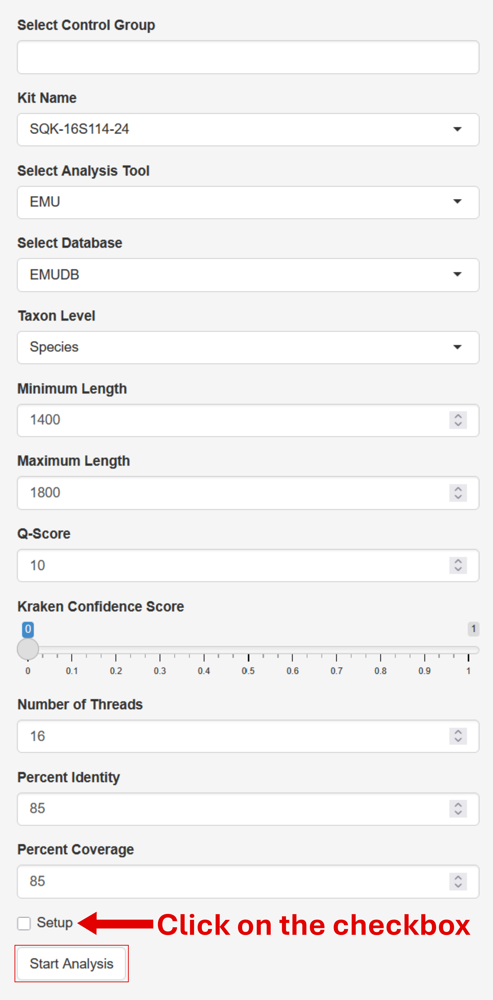

All currently supported pipelines are available in both **real-time** and **offline** modes.

---

<a name="inputdata"></a>

# **Input Data**

You can use NANOTAXI in either of the following ways:

1. Explore the pre-loaded example dataset.
2. Upload your own data for **Real-Time** or **Offline** analysis.

---

<a name="dataformat"></a>

## **Input File Format**

NANOTAXI requires a **CSV** sample information file with the following format:

- The file must be comma-separated.
- The first row must contain headers.
- The file must contain exactly two columns:
  - **Sample_Id**: barcode identifier (for example, `barcode01`)
  - **Group**: biological or experimental condition for that barcode

### **Example sample information file**

<style>
  .sample-info {
    margin-left: 30px;
    overflow-y: scroll;
    height: 200px;
    width: 60%;
  }

  .sample-info th, .sample-info td {
    padding: 10px;
    border: 1px solid #000000;
    text-align: left;
    width: 10%;
  }
</style>

<div class="sample-info">

| Sample_Id | Group |
|:--|:--|
| barcode01 | Crop Digesta |
| barcode02 | Crop Digesta |
| barcode03 | Crop Digesta |
| barcode04 | Crop Digesta |
| barcode05 | Crop Digesta |
| barcode06 | Zymobiomics |
| barcode07 | Zymobiomics |
| barcode08 | Zymobiomics |
| barcode09 | Zymobiomics |
| barcode10 | Zymobiomics |
| barcode11 | Feces |
| barcode12 | Feces |
| barcode13 | Feces |
| barcode14 | Feces |
| barcode15 | Feces |
| barcode16 | Feces |
| barcode17 | Feces |
| barcode18 | Feces |
| barcode19 | Feces |
| barcode20 | Feces |

</div>

Example file: [Sample Information](Sample_information.csv)

---

<a name="algorithm"></a>

## **Backend Pipeline**

NANOTAXI supports both **real-time** and **post-run** analysis of barcoded nanopore 16S sequencing data. It combines read filtering, taxonomic classification, and cohort-level microbiome analysis within a single interface.

## **Real-Time Analysis**

During a live sequencing run, NANOTAXI connects to MinKNOW through its API and continuously collects new reads as they are produced.

### **Workflow**

1. **Read filtering**  
   Raw FASTQ reads are filtered with **Chopper** to retain high-quality, full-length 16S reads.

2. **Taxonomic classification**  
   Filtered reads can be classified using one of the following methods:
   - **Kraken2**
   - **Minimap2**
   - **EMU**
   - **MMseqs2**

   The following databases are currently supported:
   - **NCBI RefSeq**
   - **EMU database**
   - **GSR database**
   - **MIMt database**
   - **GTDB database**

3. **Barcode-level output**  
   For each barcode, NANOTAXI generates:
   - taxon counts tables,
   - classification bar plots,
   - read-length distributions,
   - Q-score distributions,
   - rarefaction curves,
   - diversity curves.

#### **Real-Time Settings**


By default, NANOTAXI uses **24 computational threads**.

- A minimum of **4 threads** is assigned per barcode.
- Threads are distributed dynamically depending on how many barcodes are being processed.
- By default, **500 reads per barcode** are processed in each iteration.
- A default **10-second update interval** is used between iterations.

**Example:** If only 4 barcodes require processing, NANOTAXI can assign 6 threads to each barcode.

**Tip:** Increasing the batch size too much can make the interface less responsive. If you increase the batch size, also consider increasing the number of computational threads.

### **Cohort-Level Analysis During Real-Time Runs**

After **five successful classification iterations**, NANOTAXI starts a cohort-level analysis and refreshes it every **two minutes**.

This module can include:

- relative abundance bar plots,
- alpha diversity analysis,
- beta diversity analysis,
- differential abundance analysis.

For microbiome best-practice considerations, the workflow follows principles discussed by [Gloor et al.](https://www.frontiersin.org/journals/microbiology/articles/10.3389/fmicb.2017.02224/full).

## **Offline Post-Run Analysis**

Offline mode is designed for re-analysis of completed sequencing runs.

### **Supported pipelines**

- **Kraken2**
- **MMseqs2**
- **EMU**
- **Minimap2**

### **Supported databases**

- **NCBI RefSeq**
- **GTDB database**
- **GSR database**
- **MIMt database**
- **EMU database**

Offline analysis produces the same cohort-level outputs available in the real-time workflow, but without the constraints of live processing.

---

## **Output and Accessibility**

NANOTAXI is designed to make results easy to inspect and export.

- **Plots** can be downloaded as high-resolution **PDF** files.
- **Tables** can be downloaded as **CSV** files.
- Required tools and databases are installed automatically during setup, making the platform accessible to users with limited computational experience.

Graphical abstract of **NANOTAXI**:


<p style="font-size: 30px; font-weight: bold; text-align: center;">NANOTAXI OVERVIEW</p>

---

<a name="outputdata"></a>

## **Output Data**

NANOTAXI produces a cohort-level abundance table in which:

- each **row** represents a taxon,
- each **column** after the first represents a barcode,
- each numeric value represents the read count assigned to that taxon in that barcode.

### **Example output table**

<style>
  .output_data {
    margin-left: 30px;
    overflow-y: scroll;
    height: 220px;
    width: 80%;
  }

  .output_data th, .output_data td {
    padding: 10px;
    border: 1px solid #000000;
    text-align: left;
  }
</style>

<div class="output_data">

| Species                                          | barcode01        | barcode02        | barcode03        | barcode04        | barcode05        | barcode06        | barcode07        | barcode08        | barcode09        | barcode10        | barcode11        | barcode12        | barcode13        | barcode14        | barcode15        | barcode16        | barcode17        | barcode18        | barcode19        | barcode20        |
|:--------------------------------------------------|:------------------|:------------------|:------------------|:------------------|:------------------|:------------------|:------------------|:------------------|:------------------|:------------------|:------------------|:------------------|:------------------|:------------------|:------------------|:------------------|:------------------|:------------------|:------------------|:------------------|
| Campylobacter jejuni                             | 180.991028442058 | 269.598197801976 | 0                | 260.811642543672 | 168.881555384445 | 0                | 0                | 0                | 0                | 0                | 0                | 0                | 0                | 0                | 0                | 0                | 0                | 0                | 0                | 0                |
| Enterococcus cecorum                             | 12784.7903910196 | 21883.9480805205 | 1327.29172478979 | 2820.34940684495 | 29.002544204639  | 0                | 0                | 0                | 0                | 0                | 0                | 0                | 0                | 0                | 0                | 0                | 0                | 0                | 0                | 0                |
| Escherichia coli                                 | 3756.22607013967 | 126.047630530988 | 376.725885524447 | 27.0215297269712 | 0                | 27841.1161926918 | 18410.4472555767 | 21272.4542239098 | 17552.6721562524 | 11630.3039001375 | 139.33624957098  | 0                | 337.051265656356 | 0                | 21.039407864616  | 0                | 0                | 0                | 329.537726416183 | 716.564750150068 |
| Lactobacillus crispatus                          | 72277.616179126  | 41156.4490436336 | 337.287294527492 | 31770.1332767136 | 18239.9336640415 | 0                | 0                | 0                | 0                | 0                | 0                | 0                | 0                | 0                | 18.8105858090054 | 0                | 0                | 0                | 0                | 0                |
| Laceyella sacchari                               | 197.959536039938 | 85.7585820540571 | 66.7329855774953 | 83.869698209294  | 65.7473599527248 | 65.9142148211675 | 65.8520791906249 | 61.8151607154187 | 149.105397778527 | 22.8893044377443 | 152.536999353841 | 99.2333472262032 | 107.33774402952  | 115.024690725041 | 130.196340240569 | 104.822709773328 | 48.0791466738958 | 82.9791534542392 | 69.9374502273034 | 192.84110279029  |

</div>

Example output file: [Cohort Consolidated Data](Species_Counts_Data.csv)

---

<a name="vis"></a>

# **Data Visualizations**

<a name="realtime"></a>

## **Real-Time Analysis Visualizations**

### **Taxon Counts Table**

This table shows read counts per barcode at the selected taxonomic rank. By default, the display is at the **species** level, but users can switch to higher taxonomic levels up to **kingdom**.

The table can be downloaded as a **CSV** file.

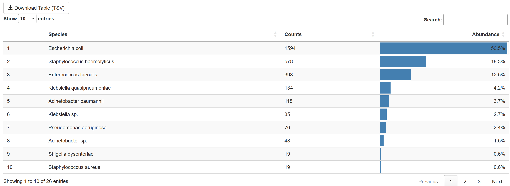

### **Read-Length Bar Plot**

This plot shows the distribution of read lengths per barcode.

- Reads between **1400 bp and 1800 bp** are shown in **Cyan Azure** and are retained as likely full-length 16S reads.
- Reads outside this range are shown in **Charm Pink** and are filtered before classification.

These filtered reads may represent low-quality reads, partial amplicons, or chimeric products that can affect downstream analysis.

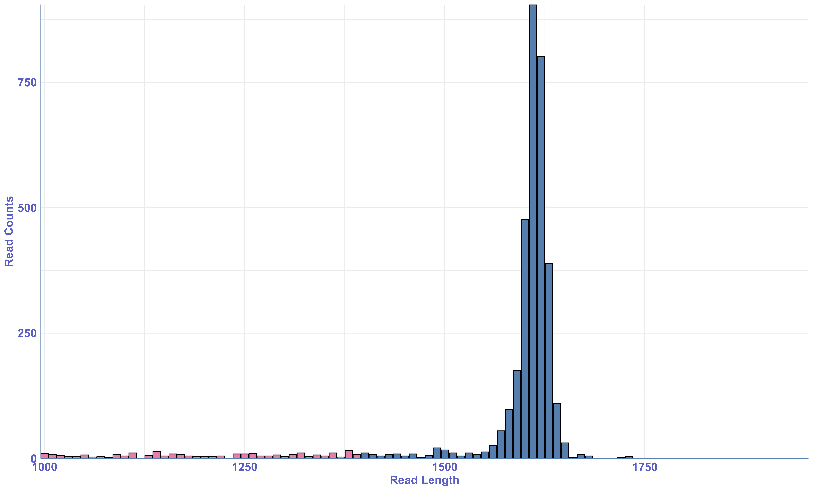

### **Q-Score Bar Plot**

This plot shows the read-quality distribution per barcode.

- Reads with **Q-score >= 10** are shown in **Cyan Azure**.
- Reads with **Q-score < 10** are shown in **Charm Pink** and are excluded before classification.

Low-quality reads are more likely to contain sequencing errors and reduce classification accuracy.

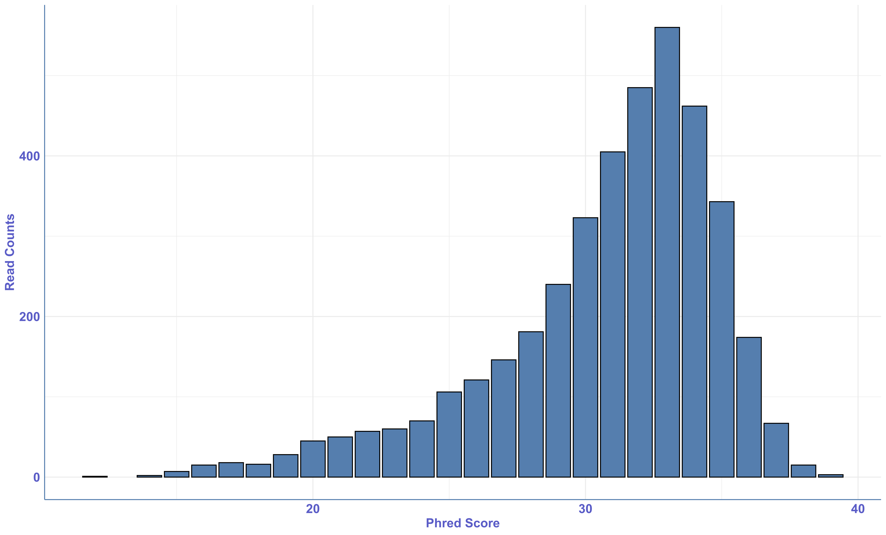

### **Read Classification Bar Plot**

This plot displays the most abundant taxa for each barcode after filtering.

- By default, the **top 10 species** are shown.
- Users can change both the number of taxa displayed and the taxonomic rank.
- Only reads passing the length and Q-score filters are included.

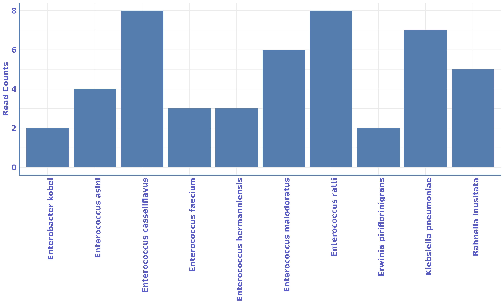

### **Rarefaction Curve**

The rarefaction curve shows how the number of observed taxa increases as more classified reads are accumulated.

- **X-axis:** number of classified reads
- **Y-axis:** number of detected taxa

A steep early rise indicates that new taxa are still being discovered. A plateau suggests that additional sequencing is unlikely to reveal substantial new diversity.

By default, only taxa supported by at least **10 reads** are included. This cutoff can be changed in the app.

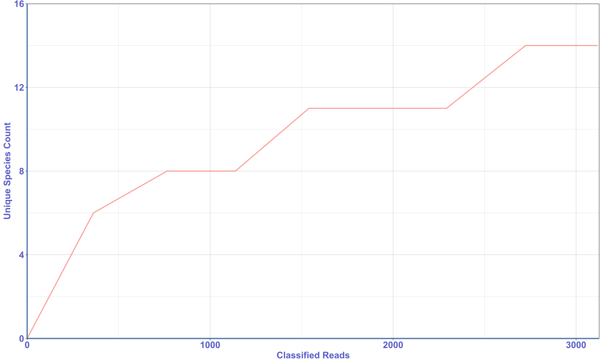

### **Diversity Curve**

This plot tracks how community diversity stabilizes as sequencing progresses.

- **X-axis:** number of classified reads
- **Y-axis:** diversity index

Two indices are shown:

- **Shannon index**, which is more sensitive to richness and rare taxa
- **Simpson index**, which is more influenced by dominant taxa

Early fluctuations are expected. Stabilization of these curves indicates that the observed community profile is becoming reliable.

By default, only taxa supported by at least **10 reads** are included. This cutoff can be changed in the app.

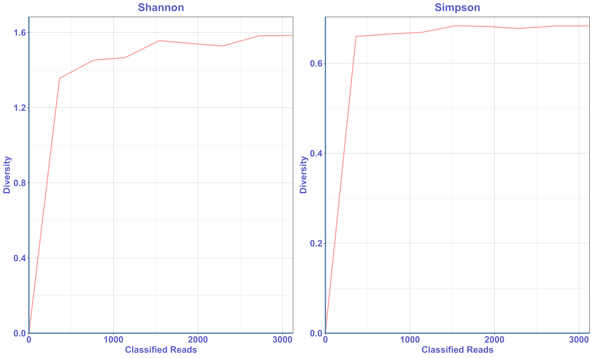

---

<a name="cohortanalysis"></a>

## **Cohort Analysis Visualizations**

The example figures below were generated from the publicly available dataset **PRJEB82315**, which contains **24 samples** from three groups: **Crop Digesta**, **Zymobiomics**, and **Feces**. In this example, NANOTAXI was run in **offline mode** using **EMU + EMU DB**.

### **Taxon Stacked Bar Plot**

This plot shows the most prevalent taxa across all barcodes.

- **Y-axis:** relative abundance (%)
- **X-axis:** barcode ID

The example below shows the **top 10 species**, but the number of taxa and taxonomic rank are user-adjustable in the app.

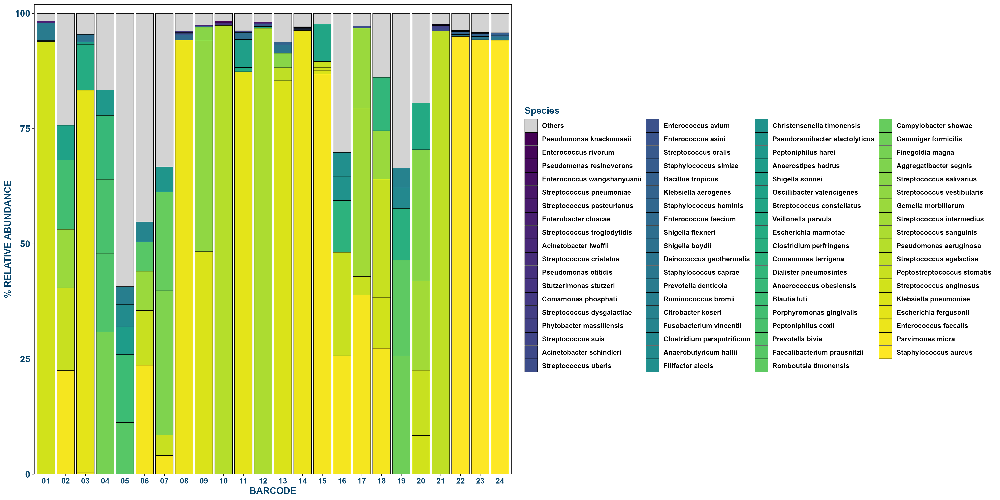

### **Alpha Diversity Box Plot**

This plot compares alpha diversity across groups defined in the **Group** column.

Alpha diversity reflects the richness and evenness of taxa within each sample. Because sequencing depth can differ between samples, NANOTAXI performs **rarefaction** before alpha diversity analysis.

The rarefaction threshold is chosen using **Good's Coverage Index**:

$$
Good's\ Coverage\ Index = 1 - \frac{F1}{N}
$$

Where:

- **F1** = number of singleton taxa
- **N** = total read count across taxa in that sample

NANOTAXI selects a library size cutoff that satisfies **95% Good's Coverage** before calculating alpha diversity metrics. 

The OTU count matrix is rarefied to this cutoff for 100 iterations. Alpha diversity metrics (Shannon and Simpson indices) are calculated for each iteration, and their average value is computed per sample. Samples are then grouped by metadata, and the **Wilcoxon rank-sum test** is used to assess differences in alpha diversity between groups. Resulting p-values are adjusted for multiple comparisons using the **Benjamini-Hochberg (BH)** procedure.

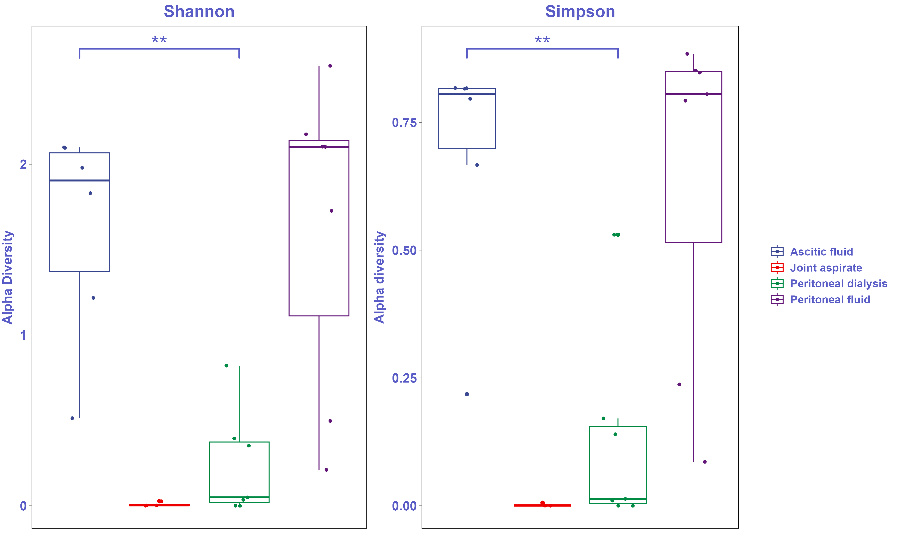

In the example dataset, fecal samples show higher alpha diversity than the other groups, consistent with a richer and more even microbial community.

### **NMDS Plot**

This plot shows **Non-Metric Multidimensional Scaling (NMDS)** based on taxon relative abundance.

Before analysis, taxa are filtered to retain those with:

- at least **10% prevalence**, and
- mean relative abundance **>= 0.1%**.

NMDS is performed using **Bray-Curtis dissimilarity**, which is widely used for microbiome abundance data.

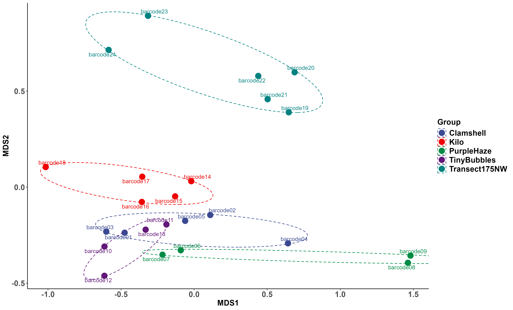

### **PCoA Plot**

This plot shows **Principal Coordinates Analysis (PCoA)** on transformed abundance data.

Workflow:

1. Filter taxa by prevalence and mean abundance.
2. Apply **Total Sum Scaling (TSS)**.
3. Apply **Centered Log-Ratio (CLR)** transformation.
4. Compute **Euclidean distance**.
5. Perform **PCoA**.

This transformation workflow reduces compositional bias before ordination.

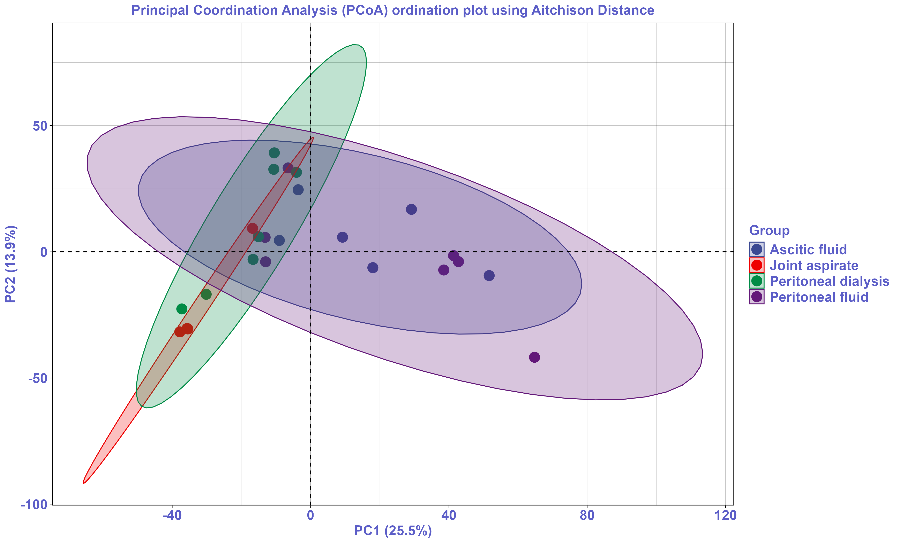

### **PCA Bi-Plot**

This plot shows **Principal Component Analysis (PCA)** on CLR-transformed counts data.

Because count tables are compositional, CLR transformation is applied before PCA to reduce constant-sum dependence between taxa.

In the example dataset, the three groups form distinct clusters, indicating clear differences in community composition.

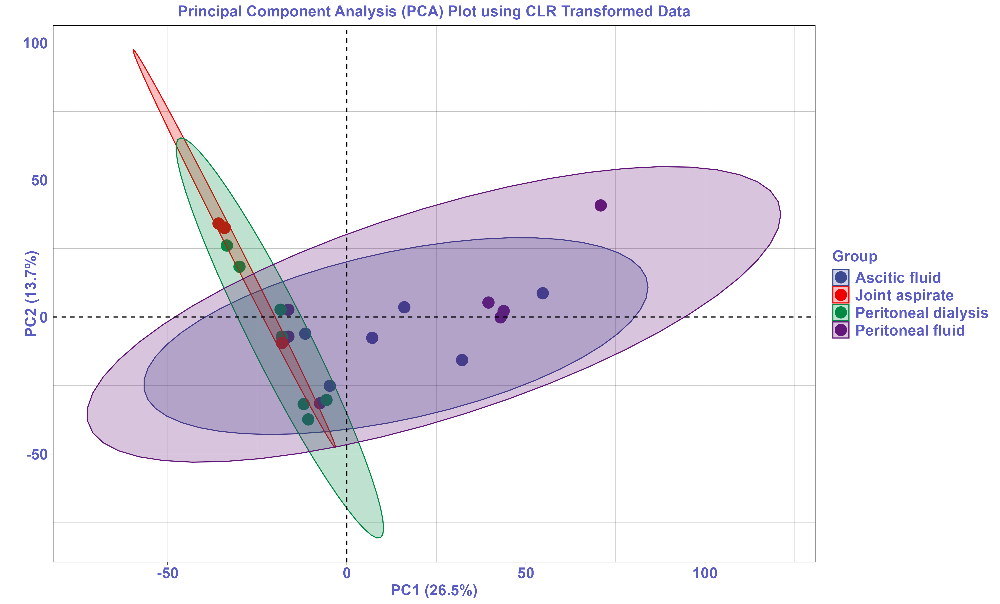

### **PERMANOVA Result**

**PERMANOVA** tests whether group centroids differ in multivariate space.

In NANOTAXI, PERMANOVA is applied to a distance matrix generated using the **Aitchison metric** on count data.

The output table contains:

- compared group pair,
- **R²**,
- raw p-value,
- adjusted p-value using **Benjamini-Hochberg** correction.

<style>
  .permanova_table {
    margin-left: 0px;
  }

  .permanova_table th, .permanova_table td {
    padding: 10px;
    border: 1px solid #000000;
    text-align: left;
    width: 10%;
  }
</style>

<div class="permanova_table">

| Pair | R² | P | Padj |
|:--|--:|--:|--:|
| Crop Digesta vs Zymobiomics | 0.754 | 0.012 | 0.012 |
| Crop Digesta vs Feces | 0.550 | 0.001 | 0.0015 |
| Zymobiomics vs Feces | 0.562 | 0.001 | 0.0015 |

</div>

### **Heatmap**

This heatmap shows taxa across rows and barcodes across columns.

- Tile color represents **Z-score normalised CLR abundance**.
- Taxa with mean relative abundance **< 0.1%** are excluded.
- Rows and columns are clustered using **Euclidean distance** and **complete-linkage hierarchical clustering**.

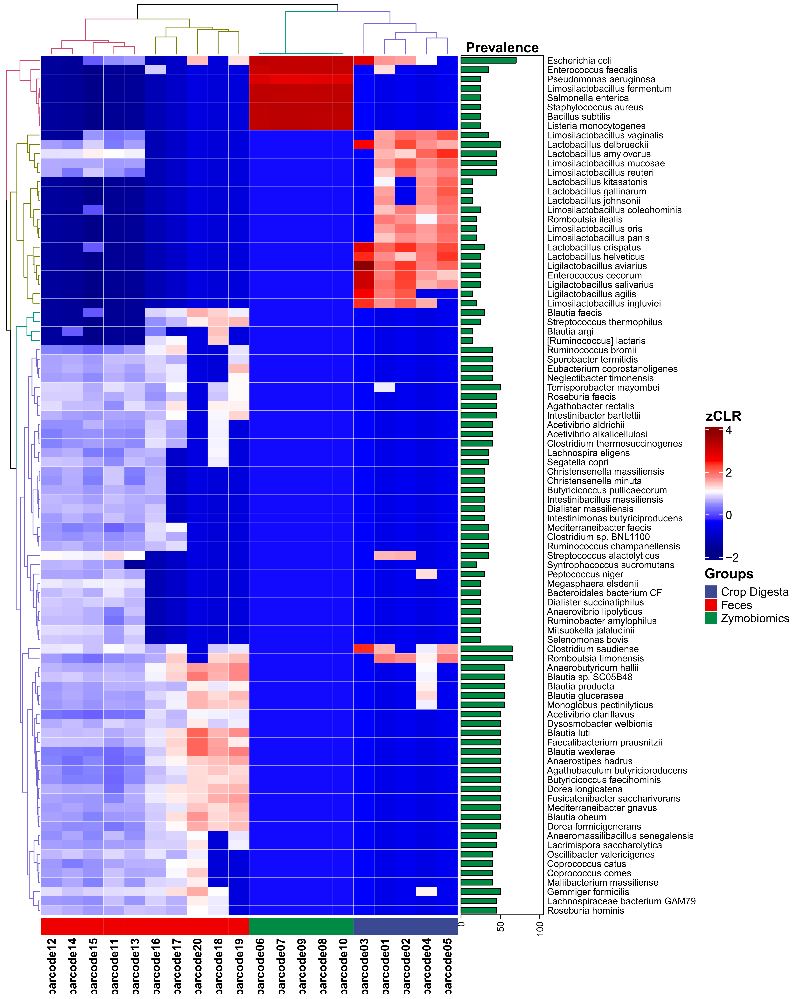

### **Taxon Differential Abundance Analysis**

The volcano plot summarizes differential abundant taxa between groups.

- **X-axis:** log2 fold change
- **Y-axis:** -log10 adjusted p-value
- **Red:** enriched taxa
- **Blue:** depleted taxa
- **Grey:** non-significant taxa

In the example dataset, **Escherichia coli** and **Enterococcus faecalis** are depleted in Zymobiomics mock community relative to the Fecal Samples.

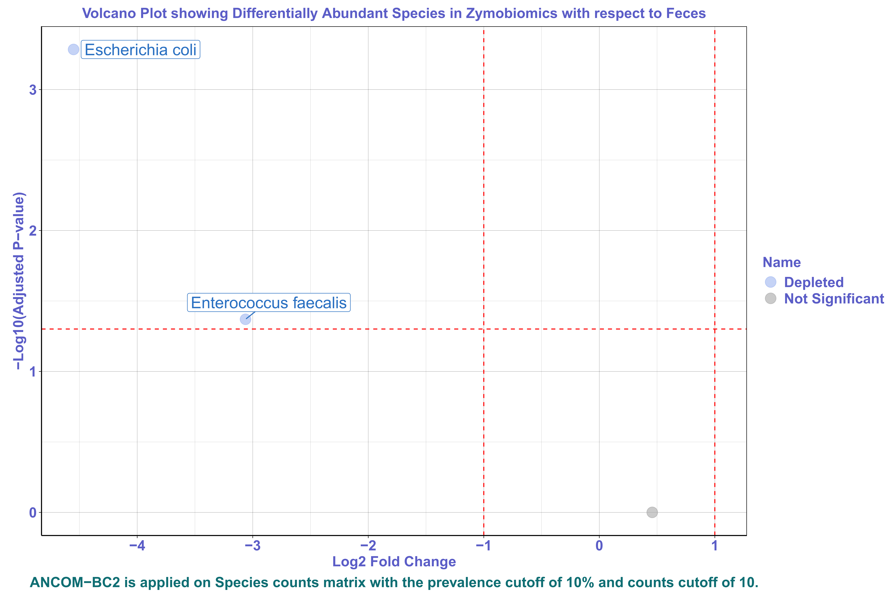

<style>
  .DAA_Data {
    margin-left: 0px;
  }

  .DAA_Data th, .DAA_Data td {
    padding: 10px;
    border: 1px solid #000000;
    text-align: left;
    width: 10%;
  }
</style>

<div class="DAA_Data">

| Species | Comparison | Sensitive | Significance | LFC | P_adj | Name |
|:--|:--|:--|:--|--:|--:|:--|
| Enterococcus faecalis | Zymobiomics - Crop Digesta | TRUE | TRUE | -5.0716 | 0.0106 | Depleted |
| Enterococcus faecalis | Zymobiomics - Feces | TRUE | TRUE | -3.0625 | 0.0427 | Depleted |
| Enterococcus faecalis | Feces - Crop Digesta | TRUE | FALSE | 2.0091 | 0.1473 | Not Significant |
| Escherichia coli | Zymobiomics - Feces | TRUE | TRUE | -4.5509 | 0.0005 | Depleted |
| Escherichia coli | Feces - Crop Digesta | TRUE | FALSE | -0.5886 | 1 | Not Significant |
| Laceyella sacchari | Zymobiomics - Crop Digesta | FALSE | FALSE | 0.6559 | 1 | Not Significant |
| Laceyella sacchari | Zymobiomics - Feces | TRUE | FALSE | 0.4582 | 1 | Not Significant |
| Laceyella sacchari | Feces - Crop Digesta | TRUE | FALSE | -0.1978 | 1 | Not Significant |
| Shigella dysenteriae | Feces - Crop Digesta | TRUE | FALSE | -2.2984 | 1 | Not Significant |

</div>

### **Functional Inference of Microbial Communities**

To estimate the functional potential of the observed microbial communities, NANOTAXI includes a functional inference workflow based on **PICRUSt2**. Using 16S rRNA gene-derived taxonomic profiles, PICRUSt2 predicts the abundances of microbial gene families and metabolic pathways, allowing downstream functional interpretation of the community composition.

NANOTAXI reports predicted functional profiles for two categories:

- **KEGG Orthologs (KO)**
- **MetaCyc pathways**

For downstream comparative analysis, the resulting functional abundance tables are normalised using **Total Sum Scaling (TSS)** and transformed using the **Centered Log-Ratio (CLR)** transformation. This reduces the effect of library-size differences and accounts for the compositional nature of the data before ordination and differential abundance analysis.

### **Functional PCA Plot**

This plot shows **Principal Component Analysis (PCA)** of the inferred functional abundance profiles. Samples are displayed on the first two principal components, with the percentage of explained variance shown on the axes. Users can choose the functional category (**KO** or **MetaCyc**) using the **Functional Pathway Group** dropdown menu.

Workflow:

1. Filter the functional abundance table by prevalence and mean abundance.
2. Apply **Total Sum Scaling (TSS)**.
3. Apply **Centered Log-Ratio (CLR)** transformation.
4. Perform **PCA**.

This analysis helps identify broad functional differences between sample groups.

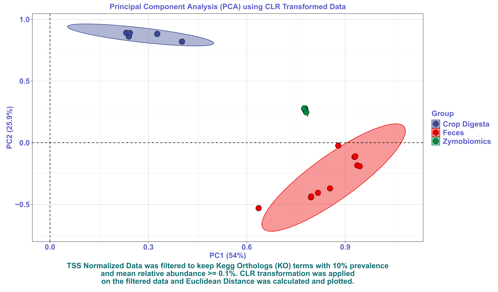

### **Functional Enrichment Dot Plot**

Differential abundance analysis is applied to the inferred functional profiles using the **ANCOM-BC2** method. For **KEGG Orthologs (KOs)**, the resulting differentially abundant terms are ranked by their adjusted p-values, and subsequent **Gene Set Enrichment Analysis (GSEA)** is performed using the **clusterProfiler** package.

The enriched pathways are displayed as a dot plot. By default, the top **10** pathways per comparison are shown, and this can be adjusted up to **20** in the app.


### **Functional Enrichment Bi-directional Bar Plot**

For **MetaCyc pathways**, differential abundance results are visualised as a bi-directional bar plot showing **log2 fold changes** between groups. This representation highlights both enriched and depleted pathways in a single view.

All functional differential abundance results can be downloaded as a **TSV** file for further analysis.

